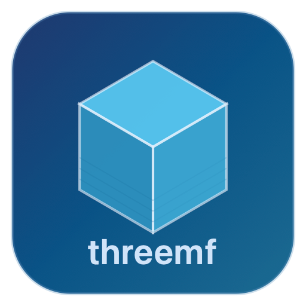

<p align="center">
  
</p>

<h1 align="center">threemf</h1>

<p align="center">Quick Look plugin for previewing <code>.3mf</code> 3D printing files on macOS.<br>Press Space in Finder to see thumbnails from Bambu Lab, PrusaSlicer, and other slicers — no need to open the file.</p>

Works by extracting the embedded thumbnail PNG from `.3mf` ZIP archives.

## Install

### Homebrew

```
brew install --cask guanchzhou/tap/threemf
```

### Manual

1. Download `threemf.zip` from [Releases](https://github.com/guanchzhou/threemf/releases)
2. Unzip and move `threemf.app` to `/Applications/`
3. Open the app once to register the Quick Look extensions

## Screenshots

<!-- TODO: add screenshots -->

## Requirements

macOS 14 (Sonoma) or later.

## Build from source

Requires [XcodeGen](https://github.com/yonaskolb/XcodeGen):

```
brew install xcodegen
xcodegen generate
xcodebuild -scheme ThreeMFQuickLook -configuration Release build
```

## License

MIT
