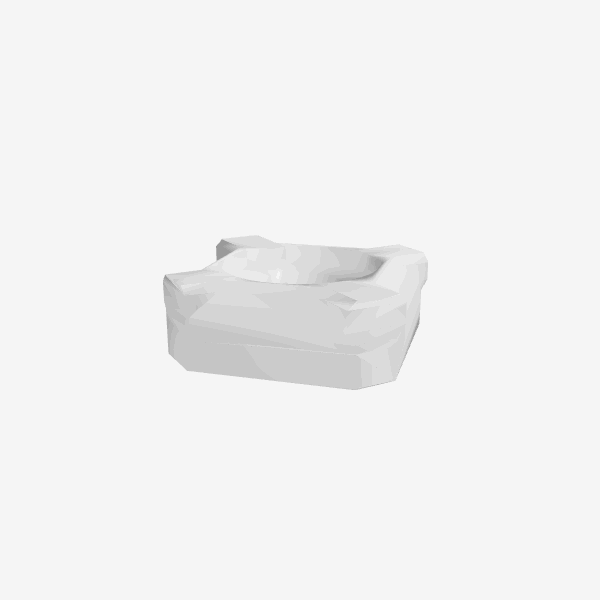
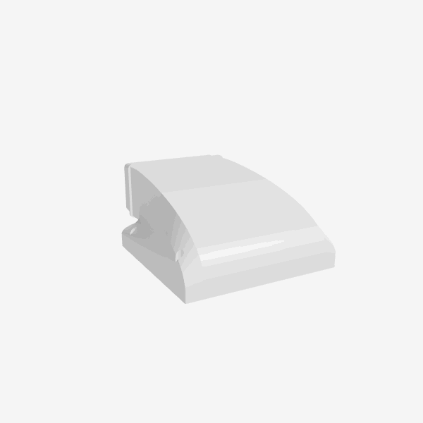

<p align="center">
  
</p>

<h1 align="center">threemf</h1>

<p align="center">Quick Look plugin for previewing <code>.3mf</code> and <code>.stl</code> 3D printing files on macOS.<br>Press Space in Finder to see interactive 3D previews — no need to open a slicer.</p>

## Features

- Interactive 3D preview with mouse rotation, pan, and zoom
- Supports `.3mf` (Bambu Lab, PrusaSlicer, etc.) and `.stl` (binary and ASCII)
- Falls back to embedded thumbnail for `.3mf` files when 3D parsing fails
- Signed and notarized for easy distribution

<p align="center">
  
  
</p>

## Install

### Homebrew

```
brew install --cask guanchzhou/tap/threemf
```

### Manual

1. Download `threemf.zip` from [Releases](https://github.com/guanchzhou/threemf/releases)
2. Unzip and move `threemf.app` to `/Applications/`
3. Open the app once to register the Quick Look extensions

## Requirements

macOS 14 (Sonoma) or later.

## Build from source

Requires [XcodeGen](https://github.com/yonaskolb/XcodeGen):

```
brew install xcodegen
xcodegen generate
xcodebuild -scheme ThreeMFQuickLook -configuration Release build
```

## License

MIT
